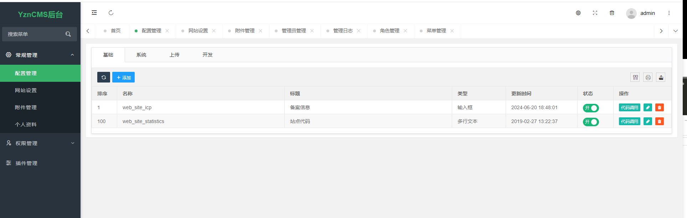
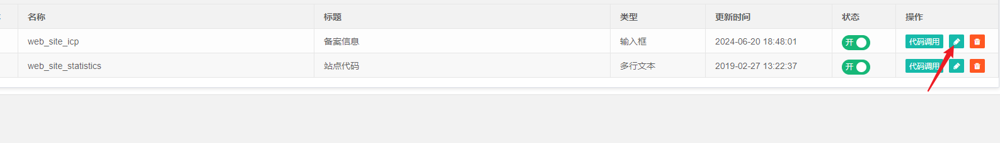
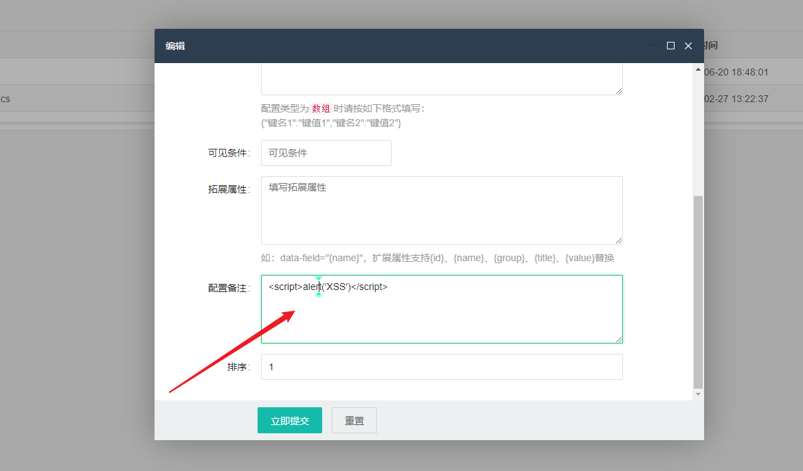
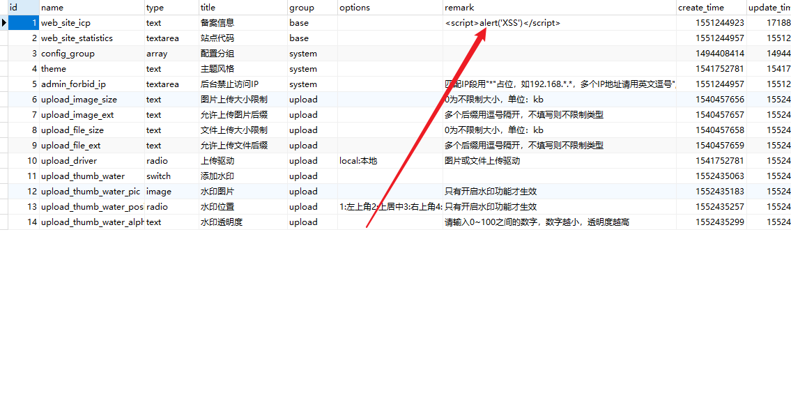
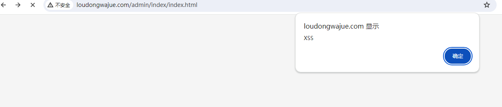

# YZNCMSv1.4.2 background management system has storage XSS vulnerability


## Vulnerability location

/admin/index/index.html

## POC

Login background



Click the Modify button



xss payload is injected in the configured remarks

```
<script>alert('XSS')</script>
```



The database was successfully injected



Updated web page xss vulnerability verification succeeded




